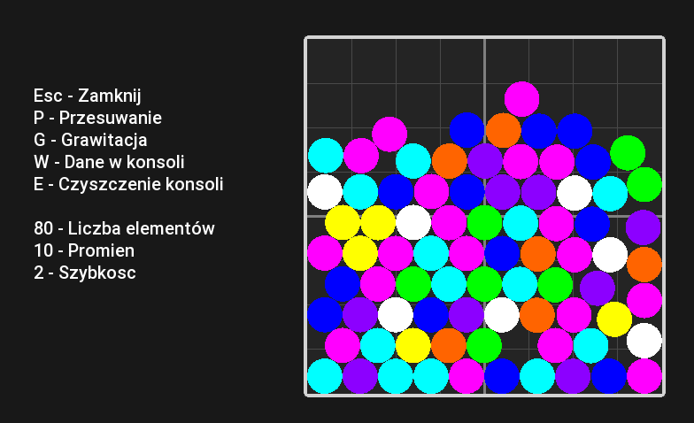

# Ball Physics Simulation

**Ball Physics Simulation** to prosta symulacja fizyki 2D napisana w C++ z wykorzystaniem biblioteki SFML. Program przedstawia interakcje kul pod wpływem grawitacji oraz umożliwia przesuwanie ich za pomocą myszy.

## Funkcje

- Ruch kul w czasie rzeczywistym z uwzględnieniem grawitacji
- Detekcja i reakcja na kolizje między kulami
- Możliwość przeciągania kul za pomocą myszy
- Wizualizacja w środowisku 2D z wykorzystaniem SFML

# Widok działania



## Wymagania

- C++17 lub nowszy
- SFML 2.5 lub nowsza wersja
- System operacyjny: Windows, Linux lub macOS

## Kompilacja i uruchomienie

1. Sklonuj repozytorium:

   ```bash
   git clone https://github.com/Psz3mo/BallPhysicsSimulation.git
   ```

2. Zbuduj projekt za pomocą preferowanego narzędzia (np. CMake, Makefile lub środowiska IDE).

3. Upewnij się, że biblioteka SFML jest poprawnie zainstalowana i skonfigurowana w projekcie.

4. Uruchom aplikację:

   ```bash
   ./BallPhysicsSimulation
   ```
